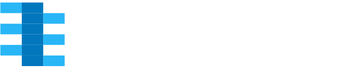

.. include:: shields.inc

.. raw:: html

     

.. raw:: latex

   \part{Introduction}

.. only:: html

   |  |SHIELD:svg:pySVModel-github| |SHIELD:svg:pySVModel-src-license| |SHIELD:svg:pySVModel-ghp-doc| |SHIELD:svg:pySVModel-doc-license| |SHIELD:svg:pySVModel-gitter|
   |  |SHIELD:svg:pySVModel-pypi-tag| |SHIELD:svg:pySVModel-pypi-status| |SHIELD:svg:pySVModel-pypi-python|
   |  |SHIELD:svg:pySVModel-gha-test| |SHIELD:svg:pySVModel-lib-status| |SHIELD:svg:pySVModel-codacy-quality| |SHIELD:svg:pySVModel-codacy-coverage| |SHIELD:svg:pySVModel-codecov-coverage|

.. Disabled shields: |SHIELD:svg:pySVModel-lib-dep| |SHIELD:svg:pySVModel-req-status| |SHIELD:svg:pySVModel-lib-rank|

.. only:: latex

   |SHIELD:png:pySVModel-github| |SHIELD:png:pySVModel-src-license| |SHIELD:png:pySVModel-ghp-doc| |SHIELD:png:pySVModel-doc-license| |SHIELD:png:pySVModel-gitter|
   |SHIELD:png:pySVModel-pypi-tag| |SHIELD:png:pySVModel-pypi-status| |SHIELD:png:pySVModel-pypi-python|
   |SHIELD:png:pySVModel-gha-test| |SHIELD:png:pySVModel-lib-status| |SHIELD:png:pySVModel-codacy-quality| |SHIELD:png:pySVModel-codacy-coverage| |SHIELD:png:pySVModel-codecov-coverage|

.. Disabled shields: |SHIELD:png:pySVModel-lib-dep| |SHIELD:png:pySVModel-req-status| |SHIELD:png:pySVModel-lib-rank|

The pySVModel Documentation
###########################

An abstract System Verilog language model.

.. _goals:

Main Goals
**********

This package provides a unified abstract language model for System Verilog (incl. Verilog).
Projects reading from source files can derive own classes and implement additional logic to create a concrete language
model for their tools.

Projects consuming pre-processed System Verilog data (parsed, analyzed or elaborated) can build higher level features
and services on such a model, while supporting multiple frontends.

.. _usecase:

Use Cases
*********

* TBD

.. _news:

News
****

.. only:: html

   Sep. 2021 - New Repository Created
   ==================================

.. only:: latex

   .. rubric:: New Repository Created

* Moved ``VerilogVersion`` and ``SystemVerilogVersion`` classes from ``pyEDAA.ProjectModel`` to this new repository.

.. _CONTRIBUTORS:

Contributors
************

* :gh:`Patrick Lehmann <Paebbels>` (Maintainer)
* :gh:`Unai Martinez-Corral <umarcor>`
* `and more... <https://GitHub.com/edaa-org/pySVModel/graphs/contributors>`__

.. _LICENSE:

License
*******

.. only:: html

   This Python package (source code) is licensed under `Apache License 2.0 <Code-License.html>`__. |br|
   The accompanying documentation is licensed under `Creative Commons - Attribution 4.0 (CC-BY 4.0) <Doc-License.html>`__.

.. only:: latex

   This Python package (source code) is licensed under **Apache License 2.0**. |br|
   The accompanying documentation is licensed under **Creative Commons - Attribution 4.0 (CC-BY 4.0)**.

.. toctree::
   :hidden:

   Used as a layer of EDA² ➚ <https://edaa-org.github.io/>

.. toctree::
   :caption: Introduction
   :hidden:

   Installation
   Dependency

.. raw:: latex

   \part{Main Documentation}

.. toctree::
   :caption: Main Documentation
   :hidden:

   LanguageModel/index

.. raw:: latex

   \part{References and Reports}

.. toctree::
   :caption: References and Reports
   :hidden:

   Python Class Reference <pySVModel/pySVModel>
   unittests/index
   coverage/index
   Doc. Coverage Report <DocCoverage>
   Static Type Check Report ➚ <typing/index>

.. raw:: latex

   \part{Appendix}

.. toctree::
   :caption: Appendix
   :hidden:

   License
   Doc-License
   Glossary
   genindex
   Python Module Index <modindex>
   TODO
